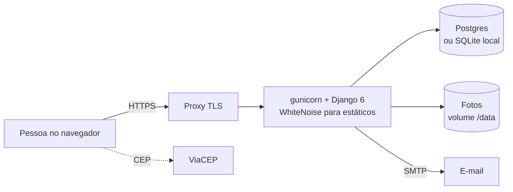

# Adote

Plataforma de adoção de animais: quem resgatou um cão ou gato divulga, quem quer adotar envia um
pedido, e quem divulgou escolhe para quem o pet vai.

[](https://github.com/edududs/Adote/actions/workflows/ci.yml)
[](https://github.com/edududs/Adote/actions/workflows/release.yml)
[](CHANGELOG.md)
[](LICENSE)

## O problema

Protetores independentes divulgam animais resgatados em grupos de mensagem e redes sociais. Os
interessados chegam todos pelo mesmo canal, cada um com uma conversa, e o protetor perde o fio:
quem perguntou primeiro, quem já foi recusado, se o pet já tem dono. O Adote organiza esse fluxo:
cada pet tem uma página, cada interessado faz um pedido com uma mensagem, e a decisão fica registrada.

## O produto

- **Divulgar:** foto, espécie (cão ou gato), raça, sexo, características (castrado, vacinado...),
  descrição, cidade e telefone de contato.
- **Adotar:** mural com filtros (espécie, raça, sexo, estado, cidade, característica) e paginação;
  na página do pet, um pedido com mensagem para quem divulgou.
- **Decidir:** quem divulgou vê os pedidos, abre o perfil de cada interessado e aprova ou recusa.
  Aprovar um pedido recusa os outros automaticamente e marca o pet como adotado.
- **Acompanhar:** quem pediu vê a situação dos seus pedidos e pode cancelar enquanto não há resposta.
  Cada mudança gera um e-mail para a pessoa envolvida.
- **Privacidade:** o telefone de quem divulgou só aparece para a pessoa cujo pedido foi aprovado.
- **Painel:** totais da plataforma e adoções por raça.

As regras completas, com o vocabulário de cada parte, estão em [docs/domain/](docs/domain/).

## Arquitetura



**Hexagonal com DDD.** Três contextos, `accounts`, `pets` e `adoption`, mais um núcleo
compartilhado (`shared`). Cada um tem `domain/` (entidades e value objects em Pydantic congelado),
`application/` (casos de uso e portas como `Protocol`) e `adapters/` (o app Django: models,
migrations, views, templates). O Django é um adaptador: domínio e aplicação não o importam, e
[`tests/test_architecture.py`](tests/test_architecture.py) percorre a AST de cada arquivo para garantir isso.

**Um pet, um agregado.** Todos os pedidos de um pet vivem no agregado `AdoptionProcess`
([`adoption/domain/process.py`](src/adote/adoption/domain/process.py)), salvo numa transação só,
com lock na linha do pet. Por isso as regras que cruzam pedidos (uma aprovação só, nenhum pedido
pendente depois da adoção, um pedido vivo por pessoa) valem sempre, e o banco as repete como
constraints. A situação "adotado" é calculada a partir dos pedidos, nunca gravada.

Detalhes em [docs/architecture.md](docs/architecture.md); o porquê de cada escolha em
[docs/decisions/](docs/decisions/README.md).

## Como rodar

Requisitos: [uv](https://docs.astral.sh/uv/) (ele instala o Python 3.14 se faltar).

```sh
uv sync                       # dependências, inclusive as de desenvolvimento
uv run poe setup              # cria o banco SQLite e a semente de demonstração
uv run poe serve              # http://127.0.0.1:8000
```

A semente cria as contas `ana`, `bruno` e `carla`, com a senha `adote-demo-2026`, cinco pets e
pedidos em todas as situações. E-mails saem no console. Variáveis de ambiente em
[.env.example](.env.example).

Com Docker (Postgres incluído): defina `DJANGO_SECRET_KEY` num `.env` e rode `docker compose up --build`.

## Qualidade

`uv run poe check` é o portão que o CI roda, e nada é dado como pronto sem ele:

| Etapa | O que garante |
|---|---|
| `ruff format --check` e `ruff check` | Todas as regras do ruff ligadas; cada exceção justificada em [ruff.toml](ruff.toml) |
| `pyright` em modo estrito | Tipos em `src/` e `tests/`, sem `Any` solto |
| `pytest` com cobertura mínima de 95% | Propriedades (Hypothesis), contratos de porta, views e arquitetura |
| `makemigrations --check` | Nenhum model mudou sem migration |
| `check --deploy` | O checklist de produção do Django passa com as configurações de produção |

O teste central é uma máquina de estados do Hypothesis
([tests/adoption/machine.py](tests/adoption/machine.py)): sorteia sequências de pedir, aprovar,
recusar e cancelar, compara cada passo com um modelo de referência ingênuo e confere todas as
invariantes. A mesma máquina roda contra o agregado puro, contra os casos de uso com repositório em
memória e contra os casos de uso com o repositório Django no banco real. O CI repete a suíte
inteira em Postgres. Estratégia completa em [docs/testing.md](docs/testing.md).

## Documentação

Comece por [docs/INDEX.md](docs/INDEX.md). Para contribuir, [CONTRIBUTING.md](CONTRIBUTING.md);
para reportar uma falha de segurança, [SECURITY.md](SECURITY.md); o histórico de versões está no
[CHANGELOG.md](CHANGELOG.md).

## Licença

[MIT](LICENSE).
