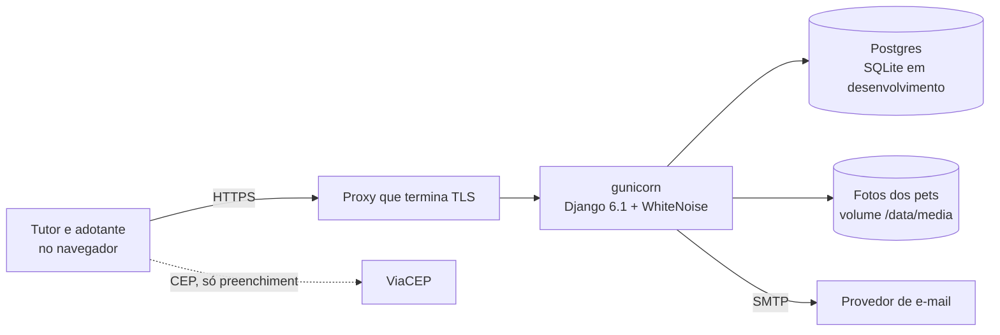

# Arquitetura

## Contexto



Uma aplicação Django 6.1 renderizada no servidor, com visual em Tailwind 4 e JS puro para as
interações (ADR 0011). Não há SPA nem API pública; só o
gráfico do painel (`/painel/dados/`) e o healthcheck (`/saude/`) respondem JSON. Todo script, estilo e fonte é servido pela própria aplicação (sem CDN), então a CSP só
aceita `'self'`; a única origem externa é a consulta de CEP feita pelo navegador.

## Contextos

| Contexto | Responde por | Agregado / entidade |
|---|---|---|
| `shared` | Value objects comuns (telefone, CEP, UF), portas de relógio e e-mail, layout | — |
| `accounts` | Cadastro, perfil, credenciais | `Profile` (value object) |
| `pets` | Divulgar e remover pets; catálogo de raças e características | `Pet` |
| `adoption` | Pedidos de adoção e a decisão; mural, painel | `AdoptionProcess` (um por pet) |
| `demo` | Semente de demonstração; só composição, sem domínio | — |

`adoption` depende de `pets` só por identificador: o processo guarda `pet_id` e `owner_id`. `pets`
precisa saber se um pet foi adotado (para não removê-lo) e pergunta pela porta `AdoptionLedger`, que
ele mesmo declara e o adaptador de `adoption` implementa (`adoption/adapters/bridges.py`).

## Camadas

```
src/adote/<contexto>/
├── domain/        entidades e value objects (Pydantic congelado), erros, eventos. Só stdlib e Pydantic.
├── application/   portas (Protocol) e casos de uso (dataclass com __call__). Só domain e shared.
└── adapters/      o app Django: models, migrations, repositórios, views, forms, templates, admin,
                   composition.py (instancia casos de uso com adaptadores reais).
```

A direção das dependências é garantida por `tests/test_architecture.py`, que lê a AST de cada
arquivo de `domain/` e `application/` e falha se aparecer um import proibido.

## Fluxo de uma escrita: aprovar um pedido

```mermaid
sequenceDiagram
    participant V as views.approve
    participant U as ApproveRequest
    participant R as DjangoAdoptionProcesses
    participant A as AdoptionProcess
    participant N as EmailNotifier
    V->>U: (request_id, by=conta)
    U->>R: pet_of(request_id)
    U->>R: change(pet_id, λ)
    R->>R: BEGIN; SELECT pet FOR UPDATE
    R->>A: carrega todos os pedidos do pet
    R->>A: λ = approve(request_id, by, at)
    A-->>R: novo processo + eventos (aprovado, recusados automáticos)
    R->>R: grava só o que mudou; COMMIT
    R-->>U: processo
    U->>N: notify(evento) para cada evento
    U-->>V: ok, ou erro de domínio
    V->>V: erro de dono/inexistente → 404; já decidido → aviso
```

O lock na linha do pet serializa duas aprovações simultâneas do mesmo pet, e também a remoção do pet
com qualquer decisão sobre ele: a checagem "não foi adotado" e a exclusão acontecem sob o mesmo lock.
As constraints do banco
(uma aprovação por pet, um pedido vivo por adotante) seguram até uma escrita que contorne o domínio.

## Fluxo de uma leitura

Páginas leem direto do ORM em `adapters/queries.py` (ADR 0004). Toda consulta que poderia mostrar
dado de outra pessoa recebe quem está vendo e filtra por isso ali mesmo, e os testes de view provam
a matriz de autorização. A única regra que a página precisa, "o que esta pessoa pode fazer aqui", vem
do agregado (`actions_for`), não do template.

## Conceitos transversais

- **Configuração:** variáveis de ambiente (12-factor), seguras por padrão: sem `DJANGO_DEBUG=1`, a
  aplicação exige segredo e hosts e liga HSTS, cookies seguros e redirecionamento para HTTPS.
  Lista completa em [.env.example](../.env.example).
- **E-mail:** porta `Mailer`; o adaptador enfileira uma tarefa do Tasks framework do Django, que
  envia pelo `MAILERS` (console sem `EMAIL_HOST`). Hoje a tarefa roda na própria requisição
  (backend imediato); um worker troca isso só na configuração. Falha de envio é registrada em log e
  nunca desfaz a ação que a causou.
- **Login:** exigido por padrão (`LoginRequiredMiddleware`); só login, cadastro, `/saude/` e as fotos
  são públicos.
- **Tempo:** porta `Clock`; nada no domínio lê o relógio sozinho.
- **Fotos:** porta `PhotoStore` sobre o storage padrão do Django, com nome aleatório; o formato é
  conferido pelo Pillow (JPEG, PNG, WEBP, até 5 MB).
- **Dados de referência:** raças e características entram por migração de dados reversível.
- **Erros:** autorização falha como 404; regra de negócio vira mensagem pt-BR na página.
