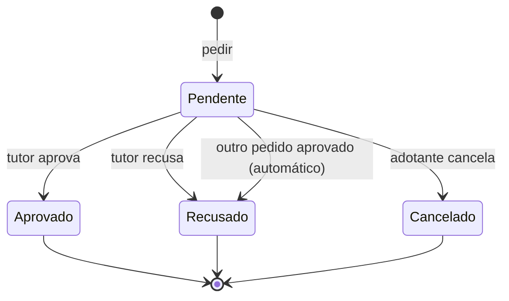

# Adoção (`adoption`)

| Termo | No código | Definição |
|---|---|---|
| Processo de adoção | `AdoptionProcess` | Todos os pedidos já feitos para um pet, e as regras entre eles. Um por pet. É o agregado. |
| Pedido | `AdoptionRequest` | Uma pessoa pedindo para adotar um pet, com mensagem opcional (até 1000 caracteres). |
| Adotante | `AdoptionRequest.adopter_id` | Quem fez o pedido. |
| Pendente | `RequestStatus.PENDING` | Aguardando o tutor. Na tela, "Aguardando resposta". |
| Aprovado | `APPROVED` | O tutor escolheu este adotante. O pet passa a ser "adotado". |
| Recusado | `REJECTED` | O tutor recusou, ou outro pedido foi aprovado (recusa automática). |
| Cancelado | `WITHDRAWN` | O próprio adotante desistiu enquanto estava pendente. |
| Pedido vivo | `BLOCKING`, `live_request_of` | Pendente, aprovado ou recusado: impede o mesmo adotante de pedir de novo o mesmo pet. |
| Adotado | `AdoptionProcess.adopted` | Existe um pedido aprovado. Calculado, nunca gravado. |
| Ações | `Action`, `actions_for` | O que uma conta pode fazer na página do pet: pedir, cancelar ou decidir. |

## Ciclo de vida de um pedido

Situação final não muda. `decided_at` é preenchido exatamente quando o pedido sai de pendente, e
nunca é anterior a `requested_at`.

## Invariantes do processo

1. O tutor não pede o próprio pet.
2. No máximo um pedido aprovado.
3. Depois de uma aprovação, nenhum pedido pendente: aprovar recusa todos os outros pendentes.
4. Cada adotante tem no máximo um pedido vivo por pet. Só um pedido cancelado deixa pedir de novo;
   uma recusa é definitiva para aquele pet.
5. Todo pedido do processo é daquele pet, e os identificadores são únicos.

O agregado recusa ser construído violando qualquer uma delas. O banco repete 2 e 4 como índices
únicos parciais e confere a coerência entre situação e `decided_at`.

## Quem pode o quê

| Comando | Quem | Erros, na ordem conferida |
|---|---|---|
| Pedir | Qualquer conta menos o tutor | `OwnPetError`, `PetAlreadyAdoptedError`, `AlreadyRequestedError` |
| Aprovar, recusar | Só o tutor | `NotTheOwnerError`, `RequestNotFoundError`, `RequestNotPendingError` |
| Cancelar | Só o adotante do pedido | `RequestNotFoundError`, `NotTheAdopterError`, `RequestNotPendingError` |

Pet inexistente: `UnknownPetError`. Pelo caso de uso, um identificador de pedido que não existe em
lugar nenhum dá `RequestNotFoundError` antes de qualquer outra conferência, porque sem o pedido não
há pet para carregar. Nas views, "não é seu" e "não existe" respondem igual (404).

## Eventos

Cada comando devolve o processo novo com os eventos que causou: `RequestSubmitted`,
`RequestApproved`, `RequestRejected` (com `automatic`) e `RequestWithdrawn`. O caso de uso entrega
cada um ao `Notifier`, que manda o e-mail para a pessoa certa. Eventos não são guardados.
